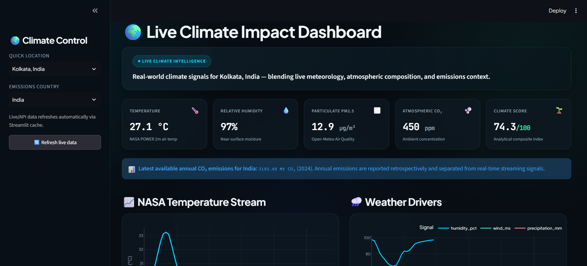
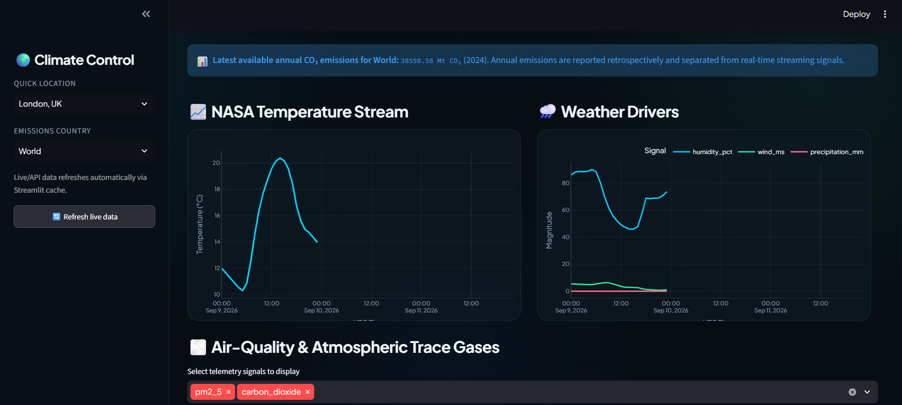
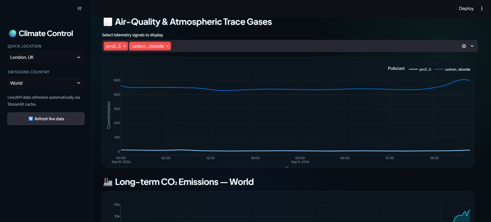
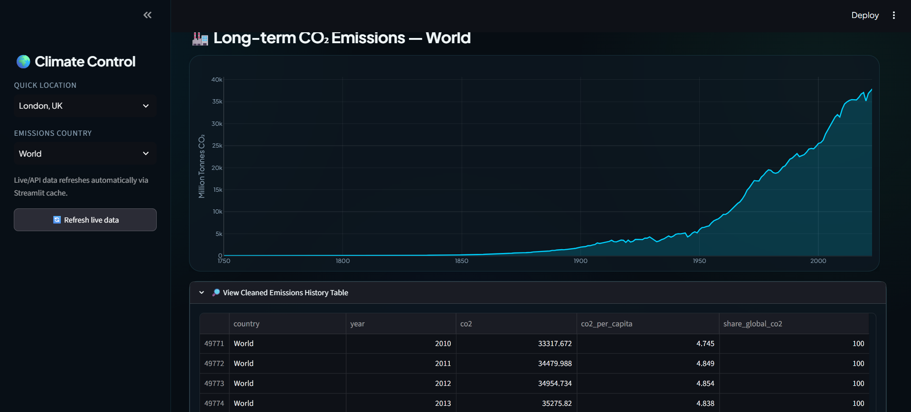

# Live Climate Impact Dashboard

A compact, portfolio-ready Streamlit data analytics project using **real external data sources**.

## What it demonstrates
- Live API ingestion with Python
- JSON and tabular data cleaning
- Pandas transformation
- Missing-value handling
- Near-real-time weather analysis
- Air-quality and atmospheric CO₂ tracking
- Historical annual CO₂ emissions analysis
- Interactive Plotly dashboards
- Clear analytical communication

## Dashboard UI overview
This dashboard is designed as a polished analyst-facing climate monitoring app with a modern dark theme, glass-style cards, and compact KPI tiles. The interface combines live environmental telemetry with historical emissions context so users can compare current conditions against longer-term trends in one view.

Key UI elements:
- Sidebar controls for location and country selection
- Live KPI cards for temperature, humidity, air quality, atmospheric CO₂, and composite climate score
- Multi-panel charts for weather, pollution, and emissions trends
- Clean trend tables and analyst notes to explain the data logic and caveats

## Dashboard screenshots

<div align="center">
  
  
  
  
</div>

## Data sources
1. **NASA POWER API** — near-real-time meteorological time series.
2. **Open-Meteo Air Quality API** — current and hourly air-quality/atmospheric signals.
3. **Our World in Data CO₂ dataset** — regularly maintained historical annual emissions data.

## Important data distinction
There is no universal public API providing truly real-time country-level CO₂ emissions. National emissions are generally calculated and published with a time lag. Therefore this project uses:
- near-real-time weather and atmospheric/air-quality signals for the live component;
- the latest available annual CO₂ emissions data for the emissions component.

This is more analytically honest than calling delayed annual emissions "live".

## Run locally

```bash
pip install -r requirements.txt
streamlit run app.py
```

Then open the local URL displayed by Streamlit.

## Why this helps with analyst jobs
The project gives you evidence of an end-to-end workflow:
**API → raw JSON → cleaning → transformation → KPIs → visualisation → business interpretation.**

Suggested CV bullet:
> Built an interactive Streamlit climate analytics dashboard integrating NASA POWER, Open-Meteo and Our World in Data sources; automated API ingestion, cleaned semi-structured environmental data with Python/Pandas, and delivered interactive KPI and trend visualisations.

## Files
This is intentionally a minimal flat project:
- `app.py`
- `requirements.txt`
- `README.md`
